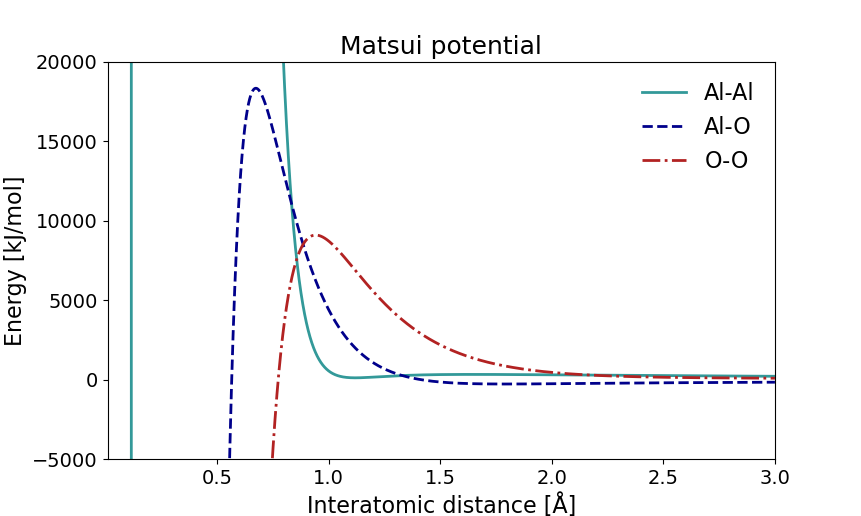
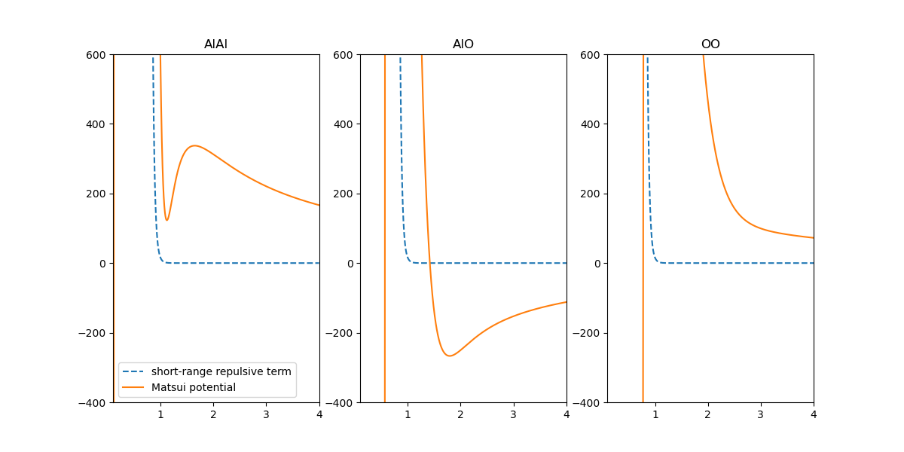
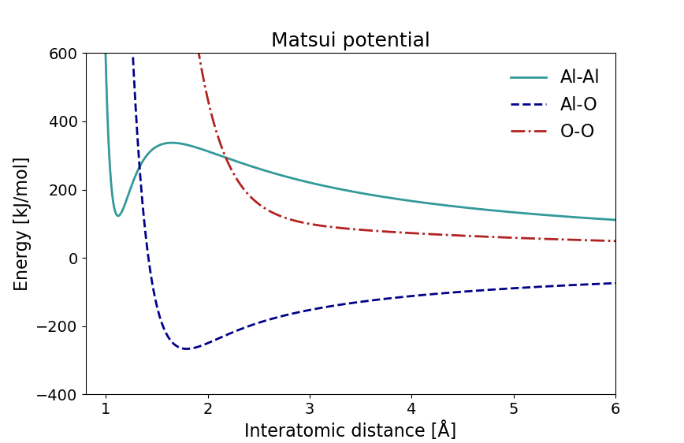
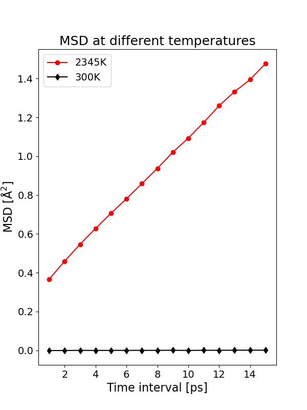
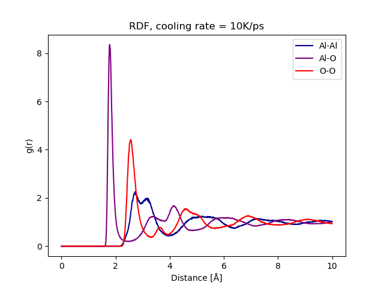
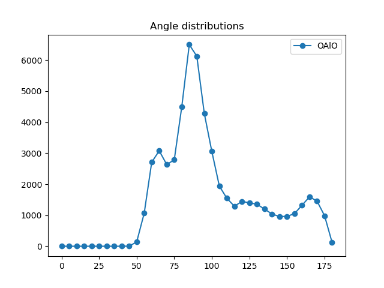
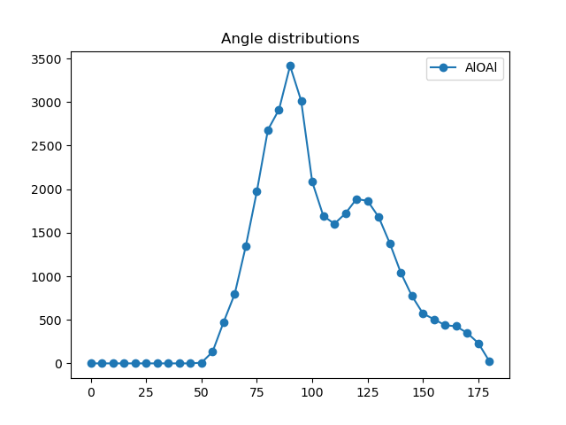
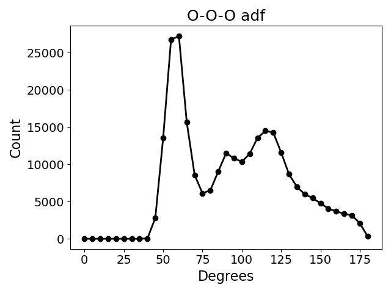
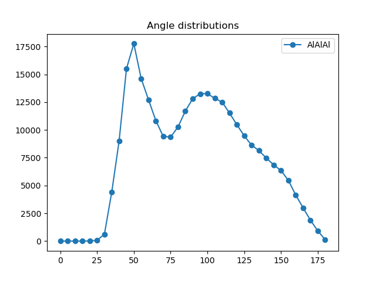

# A Machine Learning Potential for Amorphous Alumina in LAMMPS
## Abstract

# Table of Contents

1. [The Matsui Potential](#the-matsui-potential)
2. [My second title](#my-second-title)

# The Matsui Potential
This potential was developed by M. Matsui and published in 1994, "A transferable interatomic potential model for crystals and melts in the system $CaO$-$MgO$-$Al_2O_3$-$SiO_2$. The potential is expressed as,

$$V(r_{ij}) = \frac{q_i q_j}{4 \pi \epsilon_0 r_{ij}} - \frac{C_i C_j}{r_{ij}^6} + f (B_i + B_j) \exp{\left( \frac{A_{i} + A{j} - r_{ij}}{B_i + B_j} \right)}.
$$

The potential includes a Coloumbic term, a van der Waals term and a repuslion interactions. The coefficients A, B and C are dependent on the elements of atom i and j, and the numbers for aluminum and oxygen can be found in Table [[1]](#Tab1). The $f$ is a standard force of 4.184kJmol $^{-1}$ Å $^{-1}$ 

<table>
  <ttext>Table <a id="Tab1">[1]</a> : Coefficients from Matsui's paper used for Al and O in the Matsui potential [ref].
  <thead>
    <tr>
      <th></th>
      <th>q [ |e| ]</th>
      <th>A [ Å ]</th>
      <th>B [ Å ]</th>
      <th>C [ Å^3 kJ^(1/2) mol^(-1/2) ] </th>
    </tr>
  </thead>
  <tbody>
    <tr>
      <td>Al</td>
      <td>1.4175</td>
      <td>0.7852</td>
      <td>0.034</td>
      <td>36.82</td>
    </tr>
    <tr>
      <td>O</td>
      <td>-0.9450</td>
      <td>1.8215</td>
      <td>0.138</td>
      <td>90.61</td>
    </tr>
  </tbody>
</table>

The shape of the potential for the different combinations of atoms can be seen in Figure [[1]](#Fig1) below. 

 

Figure <a id="Fig1">[1]</a>: Plot of the potential as a function of distance.

 

# Amorphous aluminium oxide
The structures were simulated in LAMMPS with the born/coul/long potential which is of the same form as the Matsui potential. When producing the structures the system starts out in an initial state that is heated far over the melting point of the material. This results in the atoms experiencing large velocities which originally resulted in clusters of Aluminum atoms due to the fact that they moved so fast that the potential had no time to repulse the atoms. A workaround is to add a highly repulsive, short-range potential of the form,

$$V_{\textbf{rep}}(r_{ij}) = \frac{15}{r_{ij}^{24}},$$

which will make sure that no unphysical clustering of atoms will take place.

In the figure below the repulsive term has been added to the potential. The AlAl line has a minimum which is caused by the added repulsive potential, so this could cause some additional defects in the form of chemical Al-Al bonds. This is easily checked by investigating the radial distances between alumina atoms.
 

When the system has turned liquid, the material is cooled down to achieve the amorphous structure. If the system was cooled down slow enough it would have time to rearrange itself into the crystal. The faster the cooling is, the more unordered the structure should end up as. It is very important that the structure does indeed melt before it is cooled down again. This can be verified by measuring the MSD averaged over time for different temperatures. For a gas or liquid the MSD will be increasing over time, while for a solid it will be zero as the structure is just vibrating so the deviations average out to zero. The melting point of Al2O3 is 2345K, and as Figure [] below shows, the structure is clearly in the liquid phase. 

Radial distribution functions (RDF) from the simulations will show whether the quenching successfully produced amorphous structures as they can be compared with experimental data. The plot below shows the RDF of a structure cooled at a rate 10K/ps. The cooling rates 100K/ps and 200K/ps were also examined but they matched so the cooling rates did not seem to affect the structure in any noticeable way. 

The angular distribution functions serve a similar purpose as the RDF. These plots have not been normalized, and the y axis shows the count of sites with the same angle. Both the ADFs and RDFs have been samples at 300K. 

# Neural Networks
The hope is that the machine learning models can be used to decrease the computational requirements for molecular dynamics simulations. 
Downsides: 
The machine learning models will only be trained on amorphous alumina oxide, which means that it will only be able to do predictions on these sorts of structures. 

# DeepMD-kit
[DeepMD-kit](https://github.com/deepmodeling/deepmd-kit/tree/master) is a .....

# References
<a id="1">[1]</a> 
Han Wang, Linfeng Zhang, Jiequn Han, and Weinan E. "DeePMD-kit: A deep learning package for many-body potential energy representation and molecular dynamics." Computer Physics Communications 228 (2018): 178-184. doi:10.1016/j.cpc.2018.03.016

<a id="2">[2]</a> 
Jinzhe Zeng, Duo Zhang, Denghui Lu, Pinghui Mo, Zeyu Li, Yixiao Chen, Marián Rynik, Li'ang Huang, Ziyao Li, Shaochen Shi, Yingze Wang, Haotian Ye, Ping Tuo, Jiabin Yang, Ye Ding, Yifan Li, Davide Tisi, Qiyu Zeng, Han Bao, Yu Xia, Jiameng Huang, Koki Muraoka, Yibo Wang, Junhan Chang, Fengbo Yuan, Sigbjørn Løland Bore, Chun Cai, Yinnian Lin, Bo Wang, Jiayan Xu, Jia-Xin Zhu, Chenxing Luo, Yuzhi Zhang, Rhys E. A. Goodall, Wenshuo Liang, Anurag Kumar Singh, Sikai Yao, Jingchao Zhang, Renata Wentzcovitch, Jiequn Han, Jie Liu, Weile Jia, Darrin M. York, Weinan E, Roberto Car, Linfeng Zhang, Han Wang. "DeePMD-kit v2: A software package for deep potential models." J. Chem. Phys. 159 (2023): 054801. doi:10.1063/5.0155600

