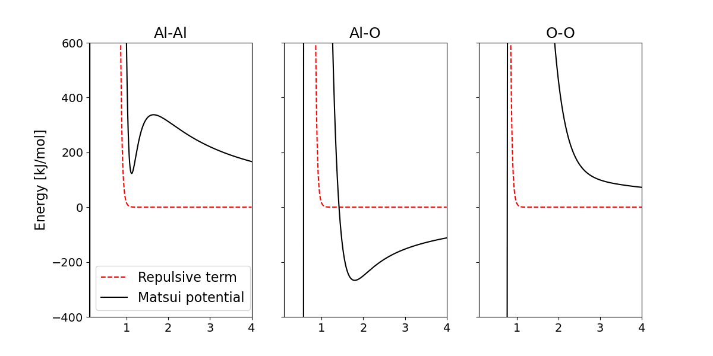

# A Machine Learning Potential for Amorphous Alumina in LAMMPS

# The Matsui Potential
This potential was developed by M. Matsui and published in 1994, "A transferable interatomic potential model for crystals and melts in the system $CaO$-$MgO$-$Al_2O_3$-$SiO_2$. The potential is expressed as,

$$V(r_{ij}) = \frac{q_i q_j}{4 \pi \epsilon_0 r_{ij}} - \frac{C_i C_j}{r_{ij}^6} + f (B_i + B_j) \exp{\left( \frac{A_{i} + A{j} - r_{ij}}{B_i + B_j} \right)}.
$$

The potential includes a Coloumbic term, a van der Waals term and a repuslion interactions. The coefficients A, B and C are dependent on the elements of atom i and j, and the numbers for aluminum and oxygen can be found in Table [ref]. The $f$ is a standard force of 4.184kJmol $^{-1}$ Å $^{-1}$ 

<table>
  <ttext>Table 1: Coefficients from Matsui's paper used for Al and O in the Matsui potential [ref].
  <thead>
    <tr>
      <th></th>
      <th>q [ |e| ]</th>
      <th>A [ Å ]</th>
      <th>B [ Å ]</th>
      <th>C [ Å^3 kJ^(1/2) mol^(-1/2) ] </th>
    </tr>
  </thead>
  <tbody>
    <tr>
      <td>Al</td>
      <td>1.4175</td>
      <td>0.7852</td>
      <td>0.034</td>
      <td>36.82</td>
    </tr>
    <tr>
      <td>O</td>
      <td>-0.9450</td>
      <td>1.8215</td>
      <td>0.138</td>
      <td>90.61</td>
    </tr>
  </tbody>
</table>

The shape of the potential for the different combinations of atoms can be seen in the figure below. 

 

# Amorphous aluminum oxide
The structures were simulated in LAMMPS with the born/coul/long potential which is of the same form as the Matsui potential. When producing the structures the system starts out in an initial state that is heated far over the melting point of the material. This results in the atoms experiencing large velocities which originally resulted in clusters of Aluminum atoms due to the fact that they moved so fast that the potential had no time to repulse the atoms. A workaround is to add a highly repulsive, short-range potential of the form,

$$V_{\textbf{rep}}(r_{ij}) = \frac{15}{r_{ij}^{24}},$$

which will make sure that no unphysical clustering of atoms will take place.

In the figure below the repulsive term has been added to the potential. The AlAl line has a minimum which is caused by the added repulsive potential, so this could cause some additional defects in the form of chemical Al-Al bonds.
 

When the system has turned liquid, the material is cooled down to achieve the amorphous structure. If the system was cooled down slow enough it would have time to rearrange itself into the crystal. The faster the cooling is, the more unordered the structure should end up as. 

Radial distribution functions from the simulations....
-,,- around melting point....

# Neural Networks
The hope is that the machine learning models can be used to decrease the computational requirements for molecular dynamics simulations. 
Downsides: 
The machine learning models will only be trained on amorphous alumina oxide, which means that it will only be able to do predictions on these sorts of structures. 
## Linear Layers
## Convolutional Layers
## Activation Function
## Loss Function
## Optimization

